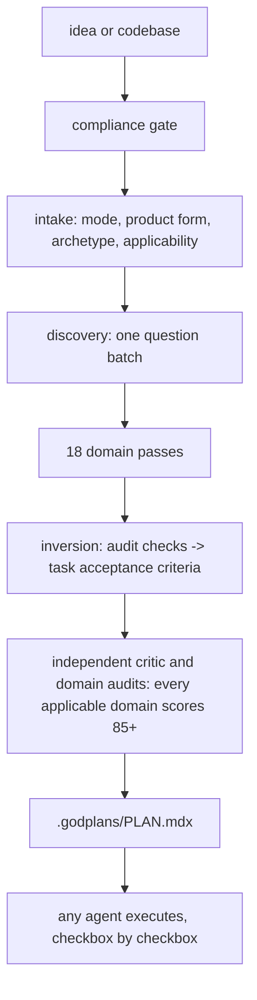

# godplans

[](https://github.com/hannsxpeter/godplans/actions/workflows/lint.yml)
[](CHANGELOG.md)
[](skills/godplans/SKILL.md)
[](LICENSE)

Plan everything before anything. godplans is a single-command AI agent skill that produces an audit-aware, agent-executable master plan (`.godplans/PLAN.mdx`) before application code is written.

It is built for AI-native solo developers and small engineering teams planning a greenfield product, a major brownfield feature, or a material replan. It is most valuable when an incomplete decision about tenancy, public APIs, data shape, permissions, deployment, or operations would be expensive to reverse after implementation starts.

Two kinds of tools already help you build software with AI, and they sit at opposite ends. Planning tools write specs, architectures, and roadmaps before you start. Auditors scan the finished code and report what slipped through: security holes, slow or unsafe database queries, fragile AI-model integrations, pages search engines cannot index, inaccessible or inconsistent UI, broken user journeys, and accumulating code-quality problems. The catch is timing. An audit runs at the end, when a missing decision has already hardened into a rewrite.

godplans merges the two by moving audit concerns forward. Checks an auditor would run at the end become requirements in the plan, attached to concrete tasks with acceptance criteria and verification commands. The up-front disciplines are settled the same way: what to build and for whom, how the parts fit together, in what order to build them, on what technology stack, how the repository and application are set up, and how the result deploys, gets monitored, launches, and is hardened. This is designed to prevent avoidable findings and rewrites. It does not replace end-of-build tests, security review, or an independent audit. The specific auditor and planner skills godplans draws from are named under [Lineage](#lineage) below.

## Quickstart

```bash
# recommended: the skills package manager (installs for your tools)
npx skills add hannsxpeter/godplans

# or: clone and run the installer
git clone https://github.com/hannsxpeter/godplans
cd godplans && sh install.sh
```

The installer refuses to overwrite or uninstall an unowned destination. Use `--force` only when replacement is intentional. Tool names such as `codex` and `copilot` are normalized to their shared Agent Skills destinations; unknown names fail instead of reporting a no-op success.

Then, in your coding agent, in any project directory:

```
/godplans I want to build a shared expense tracker for roommates
```

One command. godplans screens the idea against the Anthropic Usage Policy, asks one batch of 3 to 5 high-leverage questions (answer "defaults" to accept the recommendations), makes every hard-to-reverse decision, plans all applicable domains, runs an independent critic pass against each applicable domain rubric until every section clears 85 of 100, and emits `.godplans/PLAN.mdx`.

## What you get

One canonical plan document, `.godplans/PLAN.mdx`, containing:

- An objective with an observable definition of done, scope, and named non-goals.
- The compliance gate result and the applicability matrix (every domain planned now, deferred with an observable trigger and reversibility argument, or excluded with a reason).
- A primary product form selected before archetype, with form-specific vertical slices and completion evidence for web, API or service, CLI or SDK, mobile or desktop, data or ML, and infrastructure or IaC work.
- Plan provenance bound to source revision, a SHA-256 input digest, and a UTC validation timestamp, with stale completed or imported evidence returning the plan to `planning`.
- Decisions, hard-to-reverse bets first, each with rationale, rejected alternatives, an observable signal, a failure boundary, and a return-to-planning action; assumptions flagged as hypotheses with validation tasks.
- Numbered requirements with EARS acceptance criteria (WHEN ... THE SYSTEM SHALL ...).
- Architecture as mermaid diagrams (components with trust boundaries, data model, load-bearing flows) placed next to the claims they support.
- A style genome so the first commit already matches the intended code DNA, and the agent-memory files (AGENTS.md, pillars) the scaffold will emit.
- Phases and waves of checkbox tasks. Every task: a stable GP-number, exact files, dependencies, what it reuses, grep-verifiable acceptance criteria, one verify command whose exit code proves it, and requirement traceability.
- Goal-backward must-haves per phase, an executable phase checkpoint, a mandatory final verification phase, exactly one Open Questions section with recommended defaults, embedded rules for executing agents, and a session log.
- A generated `.godplans/PLAN.json` sidecar carrying decisions, applicability, phases, active and superseded tasks, dependencies, requirements, and plan half-life metrics for tools that should not parse MDX.

The skill also emits `.godplans/validate-plan.sh`, a self-contained companion that validates lifecycle state, provenance formats, product form, conditional public-release gates, counters, phase and task grammar, ordered dependency and requirement references, deferral constraints, falsifier blocks, executable checkpoints, banned characters, and final-phase structure. Its explicit drift mode recomputes marked provenance files, reruns a deterministic sample of completed Verify commands, and reproves the phase checkpoint. The plan remains the only source of product and execution truth; PLAN.json is generated atomically from it.

The plan is the handoff: any coding agent (the same one, or a different tool entirely) executes it checkbox by checkbox. Interrupted work resumes by re-reading the file, not the chat.

## Approval and execution

Plans have an enforced lifecycle: `planning -> approved -> executing -> done`. A new or materially changed plan remains `planning` until the user explicitly approves it. Executors validate the plan and refuse to begin from `planning` or `done`; the first executor moves `approved` to `executing`, and only a passing final Verification phase may move it to `done`.

```bash
# validate a draft before approval
bash .godplans/validate-plan.sh --allow-planning .godplans/PLAN.mdx

# validate the execution gate after approval
bash .godplans/validate-plan.sh .godplans/PLAN.mdx

# reprove a completed phase before the next phase starts
bash .godplans/validate-plan.sh --drift-check 1 .godplans/PLAN.mdx
```

## Evidence and evaluation

Repository tests cover installer collisions and aliases, portable-prompt parity, plan-validator failure modes, JSON and shell validity, version parity, immutable action pins, and the behavioral evaluation harness. The behavioral matrix also covers product-form routing, Pillars 1.1 nested scopes and catalogs, stale source evidence, stale prepublication evidence, and observability evidence labels.

```bash
npm test
npm run lint

# release-grade validation with the pinned official Agent Skills validator
python3 -m venv .venv-skills-ref
.venv-skills-ref/bin/pip install -r requirements/skills-ref.txt
SKILLS_REF_BIN="$PWD/.venv-skills-ref/bin/skills-ref" npm run release:check

# optional maintainer benchmark using already authenticated host CLIs
npm run eval:matrix

# rescore retained outputs after expectation changes
bash scripts/eval.sh --score-only
```

Conformance is not value. Passing the matrix proves the skill did what it
promised; it does not prove the promise was worth loading. The control arm
answers that: `scripts/eval.sh --baseline` runs each case a second time through
the same agent and model with no skill loaded, on a neutral request, and
reports the delta. The included Codex runners isolate `HOME` and `CODEX_HOME`.
The Claude runners use safe mode while retaining normal host authentication.
The Gemini runners use workspace-scoped skill and hook controls. Every runner
records its isolation mode, and the control reads a de-branded
`REQUEST.baseline.md` so it is never told to use a skill it does not have.

Using godplans never requires provider credentials. The optional repository
benchmarks invoke host CLIs through the runner contract and reuse whatever
authentication those tools already have.

```bash
GODPLANS_EVAL_RUNNER="$PWD/evals/runners/codex.sh" \
GODPLANS_EVAL_BASELINE_RUNNER="$PWD/evals/runners/codex-baseline.sh" \
bash scripts/eval.sh --baseline
```

The historical 1.8.0 baseline under `evals/baselines/` covers one model and
three cases. It is retained as provenance, but it no longer meets the evidence
minimum. Publishable release evidence now means all ten cases across Codex,
Claude, and Gemini, both arms, with raw artifacts and actual token usage. The
blind external grader adds at least two no-skill judges over five or more plan
pairs and reports the inter-rater gap. The build-outcome evaluation gives
matched plans to the same no-skill builder, hides arm identity, runs godaudits
on both built repositories, and compares open Critical and High findings. A tie
or loss is published with equal prominence.

The first published build-outcome run is directional and narrow, but it tests
the actual thesis. On the `tenant-notes-api` case, both `gpt-5.6-sol` arms
passed the same verifier. The godplans artifact had 0 Critical and 1 High
finding; the no-skill control had 1 Critical and 4 High findings, a -4 Critical
plus High delta. The cost was also large: 11,236,025 cumulative
CLI-reported plan tokens for treatment versus 162,816 for control, including
cached input. See the [method, limitations, and raw
artifacts](evals/outcomes/results/2026-07-23-tenant-notes-api-codex/README.md).



## Why plan-first beats audit-later

An auditor that finds a missing tenant-isolation policy after three weeks of building has found a rewrite. A plan that requires `workspace_id` with row-level security on every tenant-owned table before the first migration has prevented one. Remediation is the most expensive way to learn what the requirements were. godplans spends that learning at plan time, when a decision costs a sentence instead of a sprint.

## Lineage

godplans consolidates and inverts thirteen skills into one command:

| Source | What carries over |
|---|---|
| [arc-ready](https://github.com/hannsxpeter/arc-ready) / [ready-suite](https://github.com/hannsxpeter/ready-suite) | The tier disciplines: PRD, architecture, roadmap, stack, repo, build, deploy, observe, launch, harden; the decision-hypothesis-question rule; the substitution test |
| [codeauditor](https://github.com/hannsxpeter/codeauditor) | 9 code-quality lenses, inverted into plan requirements |
| [secauditor](https://github.com/hannsxpeter/secauditor) | 11 OWASP/CWE-grounded dimensions, inverted; paper-control refusals |
| [dbauditor](https://github.com/hannsxpeter/dbauditor) | Schema, indexing, transactions, migrations, data protection, planned upfront |
| [llmauditor](https://github.com/hannsxpeter/llmauditor) | 12 LLM-integration dimensions: prompts, routing, cost, evals, guardrails |
| [seoauditor](https://github.com/hannsxpeter/seoauditor) | Search and AI-answer-engine visibility decided at architecture time |
| [uiauditor](https://github.com/hannsxpeter/uiauditor) | Accessibility, semantics, design-system consistency as acceptance criteria |
| [uxauditor](https://github.com/hannsxpeter/uxauditor) | Journeys, workflows, error states designed before build |
| [pillars](https://github.com/hannsxpeter/pillars) | Pillars 1.1 agent memory: nested scopes, local absent catalogs, deterministic routing, and context budgets |
| [codedna](https://github.com/hannsxpeter/codedna) | The style genome: prescribed for greenfield, fingerprinted for brownfield |
| [BuilderIO visual-plan](https://github.com/BuilderIO/skills) | Plan discipline: hard-to-reverse bets first, reuse-first steps, one Open Questions section, the standalone-plan rule, the visual layer |
| [ADHD](https://github.com/UditAkhourii/adhd) (MIT, Udit Akhouri) | Two ideas, re-expressed for planning: the critic must not be the author (Phase 6), and a menu of options is not a set of alternatives (R-STACK-21, the R-ARCH-4 open set, the Open Questions off-framing rule). No text, prompt, or code copied; godplans takes none of its novelty scoring, frame library, or runtime |

## Modes

- **Greenfield**: the full arc from idea to plan.
- **Brownfield**: fingerprints the existing codebase first (stack, structure, style genome, conventions); the plan extends what exists and cites real files.
- **Replan**: `.godplans/PLAN.mdx` already exists; state and provenance are re-derived from disk, material evidence drift returns the plan to `planning`, completed work is never rewritten, new work gets new task IDs, and superseded tasks are struck through with reasons.

## Tool support

The canonical skill lives at `skills/godplans/` in the Agent Skills format. `install.sh` exploits path convergence, so six destinations cover the clients listed below:

| Tool | Install path | Invoke |
|---|---|---|
| Claude Code | `~/.claude/skills/godplans` | `/godplans` |
| Codex CLI | `~/.agents/skills/godplans` | `$godplans` |
| Cursor | reads `.agents` and `.claude` paths | `/godplans` |
| VS Code / Copilot | reads `.claude` and `.agents` paths; project `.github/skills` | `/godplans` |
| Zed | `~/.agents/skills/godplans` | `/godplans` |
| OpenCode | reads `.claude` and `.agents` paths | auto |
| Windsurf | reads compat paths; native `~/.codeium/windsurf/skills` | `@godplans` |
| Gemini CLI | `~/.agents/skills/godplans` (or `gemini skills install <git-url>`) | auto |
| Amp | reads `.agents` and `.claude` paths | auto |
| Factory Droid | `~/.factory/skills/godplans` | `/godplans` |
| Cline | `~/.cline/skills/godplans` | auto |
| T3 Chat | no skill support: paste [PROMPT.md](PROMPT.md), then attach applicable lazy modules from `skills/godplans/references/` | manual |
| Aider | `aider --read PROMPT.md` | manual |
| Any chat UI | paste [PROMPT.md](PROMPT.md) as the system prompt | manual |

`PROMPT.md` is the generated slim core: discovery, plan format, product, architecture, stack, database, security, exemplar, template, validator, and plan half-life script. Remaining domains stay lazy as individual files under `skills/godplans/references/` and are attached only when applicable. Generate the historical all-in-one form for a one-off surface with `bash scripts/build-prompt.sh --full --output PROMPT.full.md`.

`evals/metrics/context-cost.json` records byte counts and an explicitly labeled token estimate for the native skill entry, portable core, generated full prompt, and every lazy module. Real evaluation runners record actual tokens per plan.

## Anthropic policy awareness

godplans is built to keep accounts clean, per the [Anthropic Usage Policy](https://www.anthropic.com/legal/aup):

- A compliance gate screens every project before planning: prohibited purposes (fake engagement, phishing, scraping that evades safeguards, undisclosed AI passing as human) are refused with the policy category named; legitimate projects with risky components get mandatory mitigation tasks (AI disclosure, robots.txt respect, rate limiting, professional review in high-risk consumer domains).
- The skill never coaches a model past a refusal and never suggests extracting or reusing subscription credentials. Anything a plan schedules unattended specifies a supported service account, workload identity, or cloud-provider authentication flow.
- The same screening logic applies in non-Claude harnesses; every provider has an equivalent policy.

Details in [references/compliance.md](skills/godplans/references/compliance.md).

## Repository map

| Path | Role |
|---|---|
| `skills/godplans/SKILL.md` | The orchestrator: ground rules, the 8-phase method, modes, refusals |
| `skills/godplans/references/` | 22 modules: 18 domain playbooks plus plan-format, discovery, compliance, exemplar |
| `skills/godplans/templates/PLAN.template.mdx` | The plan skeleton |
| `skills/godplans/scripts/validate-plan.sh` | Self-contained PLAN.mdx validator copied beside every plan |
| `skills/godplans/scripts/plan-halflife.sh` | Cumulative and per-domain task supersession metric generator |
| `skills/godplans/schemas/PLAN.schema.json` | JSON Schema for generated PLAN.json sidecars |
| `.agents/skills/`, `.claude/skills/` | Symlink projections of the canonical skill |
| `install.sh` | Ownership-safe installer; `--project`, `--tools`, `--copy`, `--uninstall`, `--force` |
| `PROMPT.md` | Generated portable fallback |
| `scripts/lint.sh` | Meta-linter: unicode cleanliness, version parity, module contracts, PROMPT freshness |
| `scripts/release-check.sh` | Release-grade checks: pinned official validator, full suite, eval contract, tag/release parity, package dry run |
| `requirements/skills-ref.txt` | Pinned official Agent Skills validator dependency |
| `evals/` | Behavioral, external-grade, context-cost, and build-outcome evaluation contracts |
| `tests/` | Regression suite for product contracts |
| `docs/ABOUT.md` | The long-form writeup: why godplans exists and how it was designed |

## FAQ

**Why MDX?** The plan drops into MDX pipelines (Docusaurus, Nextra, Fumadocs) and MDX-native plan viewers, but the body is written GFM-safe: plain GitHub-flavored markdown that is simultaneously valid MDX. Rename to `PLAN.md` any time for GitHub rich rendering; nothing is lost.

**Does godplans build the project?** No. It plans. The emitted PLAN.mdx carries its own executor rules, so any coding agent can build from it. That separation is deliberate: plans survive tool switches; chat context does not.

**Does audit-aware mean guaranteed audit-clean?** No. The plan moves known audit checks into requirements and task acceptance criteria, which reduces preventable findings. Execution quality, runtime behavior, changing dependencies, and previously unknown risks still require tests and independent review.

**What if my project does not need SEO / a database / a launch?** Every domain is planned now, deferred with an observable trigger when waiting is reversible, or excluded with a stated reason. A CLI tool excludes seo; an internal product can defer launch until public activation planning begins; neither gets a hollow section.

**How is this different from arc-ready?** arc-ready walks the full arc tier by tier, building as it goes. godplans front-loads every decision from all tiers plus all seven auditors into one plan document before anything is built. They compose: plan with godplans, execute with anything, including arc-ready's build tiers.

## License

[MIT](LICENSE). Contributions welcome; read [CONTRIBUTING.md](CONTRIBUTING.md) first, especially the mechanically enforced style rules.
