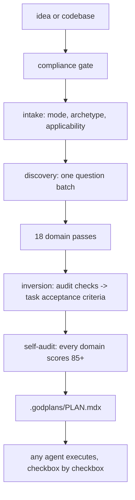

# godplans

[](https://github.com/aihxp/godplans/actions/workflows/lint.yml)
[](CHANGELOG.md)
[](skills/godplans/SKILL.md)
[](LICENSE)

Plan everything before anything. godplans is a single-command AI agent skill that produces a complete, audit-proof, agent-executable master plan (`.godplans/PLAN.mdx`) for a software project before any code is written.

Two kinds of tools already help you build software with AI, and they sit at opposite ends. Planning tools write specs, architectures, and roadmaps before you start. Auditors scan the finished code and report what slipped through: security holes, slow or unsafe database queries, fragile AI-model integrations, pages search engines cannot index, inaccessible or inconsistent UI, broken user journeys, and accumulating code-quality problems. The catch is timing. An audit runs at the end, when a missing decision has already hardened into a rewrite.

godplans merges the two by moving the audit forward. Every check an auditor would run at the end becomes a requirement in the plan, attached to a concrete task with an acceptance criterion and a command that proves it, before any code exists. The up-front disciplines are settled the same way: what to build and for whom, how the parts fit together, in what order to build them, on what technology stack, how the repository and the app itself are set up, and how the result deploys, gets monitored, launches, and is hardened against attack. Each decision is made while it still costs a sentence instead of a sprint. A project built from a godplans plan passes its audits on the first run, because the audit was satisfied by design rather than patched afterward. The specific auditor and planner skills godplans draws from are named under [Lineage](#lineage) below.

## Quickstart

```bash
# recommended: the skills package manager (installs for your tools)
npx skills add aihxp/godplans

# or: clone and run the installer
git clone https://github.com/aihxp/godplans
cd godplans && sh install.sh
```

Then, in your coding agent, in any project directory:

```
/godplans I want to build a shared expense tracker for roommates
```

One command. godplans screens the idea against the Anthropic Usage Policy, asks one batch of 3 to 5 high-leverage questions (answer "defaults" to accept the recommendations), makes every hard-to-reverse decision, plans all applicable domains, scores its own plan against each domain rubric until every section clears 85 of 100, and emits `.godplans/PLAN.mdx`.

## What you get

One file, `.godplans/PLAN.mdx`, containing:

- An objective with an observable definition of done, scope, and named non-goals.
- The compliance gate result and the applicability matrix (every domain planned or excluded with a reason).
- Decisions, hard-to-reverse bets first, each with rationale and rejected alternatives; assumptions flagged as hypotheses with validation tasks.
- Numbered requirements with EARS acceptance criteria (WHEN ... THE SYSTEM SHALL ...).
- Architecture as mermaid diagrams (components with trust boundaries, data model, load-bearing flows) placed next to the claims they support.
- A style genome so the first commit already matches the intended code DNA, and the agent-memory files (AGENTS.md, pillars) the scaffold will emit.
- Phases and waves of checkbox tasks. Every task: a stable GP-number, exact files, dependencies, what it reuses, grep-verifiable acceptance criteria, one verify command whose exit code proves it, and requirement traceability.
- Goal-backward must-haves per phase, a mandatory final verification phase, exactly one Open Questions section with recommended defaults, embedded rules for executing agents, and a session log.

The plan is the handoff: any coding agent (the same one, or a different tool entirely) executes it checkbox by checkbox. Progress is machine-checkable with grep. Interrupted work resumes by re-reading the file, not the chat.



## Why plan-first beats audit-later

An auditor that finds a missing tenant-isolation policy after three weeks of building has found a rewrite. A plan that requires `workspace_id` with row-level security on every tenant-owned table before the first migration has prevented one. Remediation is the most expensive way to learn what the requirements were. godplans spends that learning at plan time, when a decision costs a sentence instead of a sprint.

## Lineage

godplans consolidates and inverts twelve skills into one command:

| Source | What carries over |
|---|---|
| [arc-ready](https://github.com/aihxp/arc-ready) / [ready-suite](https://github.com/aihxp/ready-suite) | The tier disciplines: PRD, architecture, roadmap, stack, repo, build, deploy, observe, launch, harden; the decision-hypothesis-question rule; the substitution test |
| [codeauditor](https://github.com/aihxp/codeauditor) | 9 code-quality lenses, inverted into plan requirements |
| [secauditor](https://github.com/aihxp/secauditor) | 11 OWASP/CWE-grounded dimensions, inverted; paper-control refusals |
| [dbauditor](https://github.com/aihxp/dbauditor) | Schema, indexing, transactions, migrations, data protection, planned upfront |
| [llmauditor](https://github.com/aihxp/llmauditor) | 12 LLM-integration dimensions: prompts, routing, cost, evals, guardrails |
| [seoauditor](https://github.com/aihxp/seoauditor) | Search and AI-answer-engine visibility decided at architecture time |
| [uiauditor](https://github.com/aihxp/uiauditor) | Accessibility, semantics, design-system consistency as acceptance criteria |
| [uxauditor](https://github.com/aihxp/uxauditor) | Journeys, workflows, error states designed before build |
| [pillars](https://github.com/aihxp/pillars) | The agent-memory standard the plan tells the scaffold to emit |
| [codedna](https://github.com/aihxp/codedna) | The style genome: prescribed for greenfield, fingerprinted for brownfield |
| [BuilderIO visual-plan](https://github.com/BuilderIO/skills) | Plan discipline: hard-to-reverse bets first, reuse-first steps, one Open Questions section, the standalone-plan rule, the visual layer |

## Modes

- **Greenfield**: the full arc from idea to plan.
- **Brownfield**: fingerprints the existing codebase first (stack, structure, style genome, conventions); the plan extends what exists and cites real files.
- **Replan**: `.godplans/PLAN.mdx` already exists; state is re-derived from checkboxes, completed work is never rewritten, new work gets new task IDs, superseded tasks are struck through with reasons.

## Tool support

The canonical skill lives at `skills/godplans/` in the Agent Skills format and works in every Agent Skills client. `install.sh` exploits path convergence, so six destinations cover the ecosystem:

| Tool | Install path | Invoke |
|---|---|---|
| Claude Code | `~/.claude/skills/godplans` | `/godplans` |
| Codex CLI | `~/.agents/skills/godplans` | `$godplans` |
| Cursor | reads `.agents` and `.claude` paths | `/godplans` |
| VS Code / Copilot | reads `.claude` and `.agents` paths; project `.github/skills` | `/godplans` |
| Zed | `~/.agents/skills/godplans` | `/godplans` |
| OpenCode | reads `.claude` and `.agents` paths | auto |
| Windsurf | reads compat paths; native `~/.codeium/windsurf/skills` | `@godplans` |
| Gemini CLI | `~/.agents/skills/godplans` (or `gemini skills install <git-url>`) | auto |
| Amp | reads `.agents` and `.claude` paths | auto |
| Factory Droid | `~/.factory/skills/godplans` | `/godplans` |
| Cline | `~/.cline/skills/godplans` | auto |
| T3 Chat | no skill support: paste [PROMPT.md](PROMPT.md) into Settings, Customization, or attach it to a chat | manual |
| Aider | `aider --read PROMPT.md` | manual |
| Any chat UI | paste [PROMPT.md](PROMPT.md) as the system prompt | manual |

`PROMPT.md` is the generated single-file fallback (SKILL.md plus the load-bearing references, flattened). Regenerate with `bash scripts/build-prompt.sh`.

## Anthropic policy awareness

godplans is built to keep accounts clean, per the [Anthropic Usage Policy](https://www.anthropic.com/legal/aup):

- A compliance gate screens every project before planning: prohibited purposes (fake engagement, phishing, scraping that evades safeguards, undisclosed AI passing as human) are refused with the policy category named; legitimate projects with risky components get mandatory mitigation tasks (AI disclosure, robots.txt respect, rate limiting, professional review in high-risk consumer domains).
- The skill never coaches a model past a refusal and never suggests routing subscription OAuth outside official clients, the two behaviors most correlated with real-world account bans. Anything a plan schedules unattended specifies API-key auth.
- The same screening logic applies in non-Claude harnesses; every provider has an equivalent policy.

Details in [references/compliance.md](skills/godplans/references/compliance.md).

## Repository map

| Path | Role |
|---|---|
| `skills/godplans/SKILL.md` | The orchestrator: ground rules, the 8-phase method, modes, refusals |
| `skills/godplans/references/` | 22 modules: 18 domain playbooks plus plan-format, discovery, compliance, exemplar |
| `skills/godplans/templates/PLAN.template.mdx` | The plan skeleton |
| `.agents/skills/`, `.claude/skills/` | Symlink projections of the canonical skill |
| `install.sh` | Six-destination installer; `--project`, `--tools`, `--copy`, `--uninstall` |
| `PROMPT.md` | Generated portable fallback |
| `scripts/lint.sh` | Meta-linter: unicode cleanliness, version parity, module contracts, PROMPT freshness |
| `docs/ABOUT.md` | The long-form writeup: why godplans exists and how it was designed |

## FAQ

**Why MDX?** The plan drops into MDX pipelines (Docusaurus, Nextra, Fumadocs) and MDX-native plan viewers, but the body is written GFM-safe: plain GitHub-flavored markdown that is simultaneously valid MDX. Rename to `PLAN.md` any time for GitHub rich rendering; nothing is lost.

**Does godplans build the project?** No. It plans. The emitted PLAN.mdx carries its own executor rules, so any coding agent can build from it. That separation is deliberate: plans survive tool switches; chat context does not.

**What if my project does not need SEO / a database / a launch?** Every domain is either planned or excluded with a stated reason in the applicability matrix. A CLI tool excludes seo with a reason; it never gets a hollow SEO section.

**How is this different from arc-ready?** arc-ready walks the full arc tier by tier, building as it goes. godplans front-loads every decision from all tiers plus all seven auditors into one plan document before anything is built. They compose: plan with godplans, execute with anything, including arc-ready's build tiers.

## License

[MIT](LICENSE). Contributions welcome; read [CONTRIBUTING.md](CONTRIBUTING.md) first, especially the mechanically enforced style rules.
