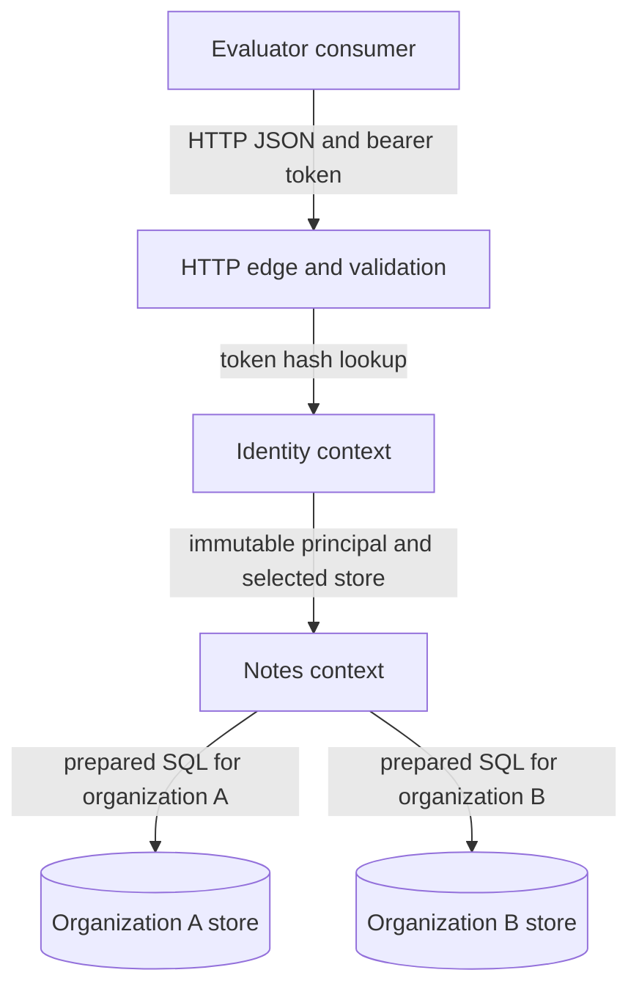
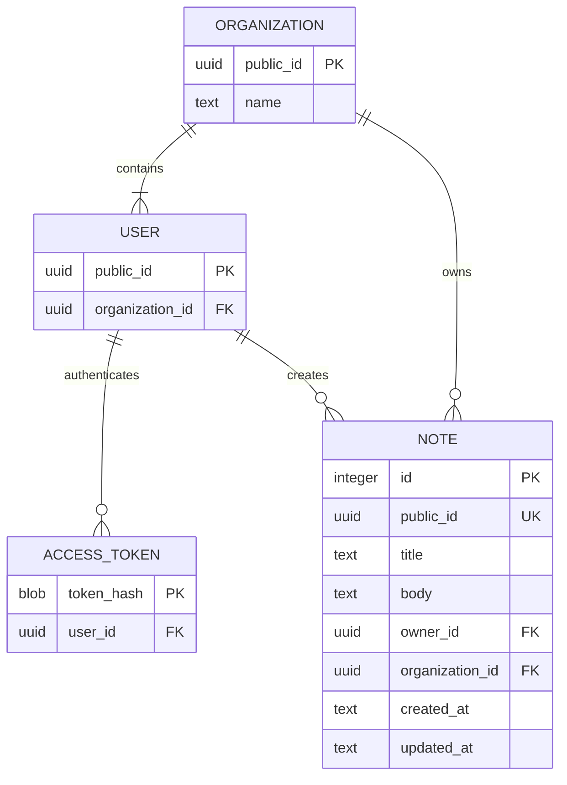

# Tenant Notes API master plan

Build a local, multi-tenant HTTP API for one evaluator working inside a six-hour implementation window. Two organizations have two seeded users each. A bearer-authenticated user can create, list, read, update, and delete notes in that user's organization and cannot observe or mutate the other organization's notes even with a known note id. Done means the committed OpenAPI contract, one Problem Details error shape, runtime validation, restart-safe local data, deterministic tests, and the exact cross-organization attack checks all pass through `npm run verify` on Node.js 22 without contacting a network service.

## Scope and non-goals

Scale and capacity: weekend calibration; one evaluator-builder; one serial track; zero non-project rotation inside the six-hour session. The hard ceiling is 3 phases and 8 tasks. Seven task appetites total 330 minutes, and 30 minutes are reserved for phase checkpoints, plan bookkeeping, and one retry of a failed local check. Total capacity is exactly 360 minutes. Scope flexes, time does not. If the reserve falls below 10 minutes before Phase 2 completes, return to planning and recommend cutting the Could item first, then the Should items; the cut requires explicit sign-off and the six-hour cap never moves.

In scope:

- Five authenticated `/v1/notes` REST operations: create, list, read, patch, and delete.
- Two organizations and four users loaded by an idempotent seed command.
- A note with opaque public id, title, body, owner id, organization id, created time, and updated time.
- One generated `openapi.json`, one RFC 9457-compatible `application/problem+json` envelope, and Fastify route-schema validation.
- Per-organization local stores, deterministic integration tests, restart persistence, structured local logs, and a dependency-aware health route.

Non-goals and non-ownership:

- No UI or browser workflow. Reconsider only if a rendered client becomes a separate evaluated deliverable.
- No user, organization, invitation, password, or token-management API. Identity lifecycle belongs to a future identity product; reconsider if evaluators must create a fifth user through HTTP.
- No cloud, container, public URL, staging environment, or release automation. Reconsider before any non-local service activation.
- No billing, search, attachments, sharing across organizations, audit-log product, or note version history. Reconsider when a requirement names one.
- Deferred: SLOs, dashboards, alerting, and on-call process wait until the first non-evaluator user or uptime promise.
- Rabbit hole: a general tenant provisioning platform would tempt dynamic database creation, key rotation, and migrations across arbitrary organizations. The smallest version fixes the store registry at two seeded organizations and validates both stores at startup.

### Product pre-flight

Mode: greenfield product. The evaluator today distinguishes a tenant-safe backend from a happy-path CRUD demo by manually issuing known-id requests, inspecting SQL, restarting the process, and comparing records. That consumes the same six-hour window intended for implementation and can still miss one unscoped mutation.

The primary user is a backend evaluator running one Node.js 22 repository locally under a strict six-hour cap, with no paid service and no runtime network dependency. A cross-organization leak invalidates the result even if every same-organization request succeeds.

The existing workaround is a curl script plus source inspection and an informal restart check. The concrete cost of failure is the six-hour attempt and an untrustworthy evaluation result. The 90-day outcome is reproducibility: a later reviewer reruns one local gate and receives the same authorization and persistence evidence. Appetite is six hours, with scope cuts instead of deadline movement. Substitution against JSONPlaceholder fails because its public fake data does not persist or authenticate; substitution against a default Supabase table fails because this evaluation requires a repository-local process and explicit known-id adversarial tests.

Primary user:

- Role: backend implementation evaluator.
- Context: one local evaluation session followed by repeatable review runs.
- Constraint: Node.js 22, no paid service, no network dependency while running.
- Current workaround: manual curl calls plus source inspection of tenant filters.
- Evidence: the normalized evaluation brief recorded in `## Plan provenance`.

### Outcome gates

| Indicator | Target and window | Outcome | Source |
|---|---|---|---|
| Leading | By minute 135, contract, auth rejection, migrations, and seeds pass | The evaluator can exercise a real authenticated boundary before CRUD expansion | `npm run contract:check` and Phase 1 checkpoint |
| Security | By minute 290, all five named cross-organization cases pass | A known organization B note id yields no read or mutation from organization A | `tests/tenant-isolation.test.ts` |
| Lagging | By minute 360, two consecutive `npm run verify` runs pass against a restart cycle | The result is deterministic and persisted data survives process reconstruction | Phase 3 checkpoint |

### NFR profile

| Dimension | Decision and basis |
|---|---|
| Performance | Budget p95 at 100 ms for one local request at 1,000 notes per organization; planning assumption, checked only if functional work finishes early |
| Scale | Exactly 2 organizations, 4 users, at most 1,000 notes per organization, and 10 requests per second; derived from the evaluation brief plus a conservative demo ceiling |
| Availability | No uptime promise; process restart must retain data because restart safety is explicit |
| Security | Deny by default; no organization id comes from request data; known-id cross-tenant read, patch, and delete return the same 404 as absence |
| Privacy | Note title and body may contain private text; neither appears in logs; no regulated class is assumed |
| Compliance | No sector-specific regime, public release, or enterprise control program is in scope |
| Accessibility | Excluded because there is no rendered surface; error payloads remain machine-readable |
| Internationalization | UTF-8 note content is accepted; contract keys and errors are English for this evaluation |
| Observability | JSON request and security-event logs plus a store-aware health route; no metrics backend |
| Data retention | Notes remain until hard delete; there is no backup or recovery promise |

### Risks

| Risk | Owner | Mitigation | Trigger signal |
|---|---|---|---|
| A handler reaches the wrong tenant store | evaluator-builder | Principal-derived store selection plus organization predicates and adversarial tests | Any organization A request returns organization B content or changes its checksum |
| Physical tenant files consume the timebox | evaluator-builder | Keep the registry fixed at two stores and one migration | GP-102 exceeds 50 minutes |
| Contract and runtime drift | evaluator-builder | Generate OpenAPI from mounted route schemas and compare the committed artifact | `npm run contract:check` exits nonzero |
| Token material leaks into logs | evaluator-builder | Hash stored tokens and redact the Authorization header in the root logger | A log-capture test finds a raw token |

## Plan provenance

Source revision: none
Input digest: sha256:108cd9f004f8eb0a427ecd6a51f2e06dd95032e63ff496d9f22aa26f7176f061
Validated at: 2026-07-23T05:04:00Z
Evidence inventory:
- `intake` = `sha256:b25eef04a3be7e76e1f24b1655a5cdd3ec8d48faad2e119565d318358c65ae9d`

## Product form

Primary: API or service.

Vertical slice: OpenAPI route schema -> validation and bearer authentication -> principal-derived tenant selection -> note operation -> local relational persistence -> structured response or Problem Details -> deterministic integration test.

Completion evidence: a real consumer fixture starts the application against a temporary copy of both tenant stores, performs authenticated CRUD, receives the documented error envelope, closes and reconstructs the process, and rereads the note. The same fixture proves known-id tenant denial. There is no secondary product form.

## Compliance gate

Result: pass
Screened: 2026-07-23 against anthropic.com/legal/aup (2025-09-15 version).
Account safety: unattended runs use supported workload authentication; no subscription credentials outside official clients.

## Applicability matrix

| Domain | Status | Reason |
|---|---|---|
| product | applicable | The six-hour gate needs an explicit user, outcome, cut policy, and negative scope |
| architecture | applicable | Tenant storage, authentication, public ids, wire format, and trust boundaries are load-bearing |
| stack | applicable | Offline runtime, Node.js 22, and the time cap eliminate service-backed choices |
| database | applicable | Notes and identities must persist across restart with tenant constraints |
| security | applicable | Bearer authentication and multi-tenant CRUD create an IDOR boundary |
| llm | excluded | The API performs deterministic note CRUD and makes no model calls |
| ux | applicable | The developer-facing contract needs predictable recovery-oriented errors |
| ui | excluded | The deliverable is an HTTP contract with no rendered pixels |
| seo | excluded | There is no crawlable page or public discovery surface |
| code-quality | applicable | Deterministic tests and a six-hour handoff require a small enforced quality baseline |
| style-genome | applicable | Greenfield naming and error conventions must be fixed before the first handler |
| agent-memory | applicable | A thin loader and three small pillars keep execution aligned without a full program |
| repo | applicable | The evaluator needs a reproducible local repository and one verification command |
| build | applicable | Authenticated CRUD must be delivered as a real vertical slice |
| roadmap | applicable | The six-hour appetite requires dependency order and hard cut rules |
| deploy | excluded | The evaluation runs as a local Node process and explicitly excludes cloud deployment |
| observe | deferred | Trigger: before the first non-evaluator user or uptime promise. Local logs and health ship now; backend, SLO, paging, and runbook infrastructure remain reversible without service commitments |
| launch | excluded | The evaluation ends at local verification and has no public activation |

Module disposition:

- Product landed: R-PRD-1 through R-PRD-11, R-PRD-13, R-PRD-15. Scale-excluded: R-PRD-12 prior-art dossier, R-PRD-14 multi-role sign-off, R-PRD-16 visual identity, and R-PRD-17 post-launch work because this is a six-hour API evaluation with no launch.
- Architecture landed: R-ARCH-1 through R-ARCH-13, R-ARCH-15, R-ARCH-17, R-ARCH-19, R-ARCH-20. Scale-excluded: R-ARCH-14 three-file ADR corpus, R-ARCH-16 dedicated fitness tooling, and R-ARCH-18 30-day drift audit; GP-101 records one combined ADR and GP-301 checks runtime conformance.
- Stack landed: R-STACK-1 through R-STACK-12, R-STACK-14 through R-STACK-16, R-STACK-20, R-STACK-21. R-STACK-12 lands as the explicit H-4 novelty hypothesis because three comparable dated deployments cannot be evidenced inside this intake. Scale-excluded: R-STACK-13 regulated or hosted operations evidence, R-STACK-17 duplicate decision artifact, R-STACK-18 unresolved stack questions, and R-STACK-19 migration because no incumbent exists.
- Database landed: R-DB-1 through R-DB-3, R-DB-5, R-DB-6, R-DB-8, R-DB-10, R-DB-12 through R-DB-14, R-DB-17, R-DB-19, R-DB-22. Scale-excluded: money, soft delete, retry dedup, external I/O, populated-table evolution, search, growth operations, and reconciliation requirements R-DB-4, R-DB-7, R-DB-9, R-DB-11, R-DB-15, R-DB-16, R-DB-20, R-DB-21, R-DB-23 because those surfaces do not exist. The two-role, TLS, and private-network portions of R-DB-18 do not exist in an embedded per-tenant file; prepared queries, mode `0600` files, and separation of migration code from repositories are the scaled local controls.
- Security landed: R-SEC-1 through R-SEC-5, R-SEC-8, R-SEC-12, R-SEC-13, R-SEC-15 through R-SEC-17, R-SEC-19, R-SEC-20, R-SEC-24, R-SEC-25. Scale-excluded: password, session, OAuth, outbound fetch, application encryption, hosted CI, regulated data, container, LLM, and public-release requirements R-SEC-6, R-SEC-7, R-SEC-9 through R-SEC-11, R-SEC-14, R-SEC-18, R-SEC-21 through R-SEC-23, R-SEC-26. Bearer-token expiry, constant-time verification, local throttling, response cache controls, supply-chain checks, and secret rotation still land because authentication and private note content are present.
- UX landed: R-UX-1, R-UX-2, R-UX-6, R-UX-7, R-UX-20. Scale-excluded: R-UX-3 through R-UX-5 and R-UX-8 through R-UX-19 because they govern rendered, multi-step, billing, or multi-actor surfaces absent from this API.
- Code quality landed: R-CODE-1 through R-CODE-10, R-CODE-12, R-CODE-14, R-CODE-15, R-CODE-17 through R-CODE-24. Scale-excluded: R-CODE-11 coverage percentages, R-CODE-13 outbound network policy, and R-CODE-16 cache policy because none is claimed or used.
- Style genome landed: R-DNA-1 through R-DNA-19. Scale-excluded: R-DNA-20 because this is greenfield.
- Agent memory landed: R-MEM-1, R-MEM-2, R-MEM-5, R-MEM-8, R-MEM-10 through R-MEM-12, R-MEM-16 through R-MEM-18, R-MEM-21, R-MEM-22. Scale-excluded: the full 22-concern pillar inventory, nested scopes, local catalog, and coupling promotion in R-MEM-3, R-MEM-4, R-MEM-6, R-MEM-7, R-MEM-9, R-MEM-13 through R-MEM-15, R-MEM-19, R-MEM-20 because one evaluator and one package need only the floor plus quality guidance.
- Repository landed: R-REPO-1, R-REPO-3, R-REPO-4, R-REPO-7, R-REPO-10, R-REPO-11, R-REPO-14, R-REPO-16 through R-REPO-21. Scale-excluded: brownfield, polyglot, public identity placeholders, community docs, hosted CI and security automation, release machinery, and hardened agent-safety requirements R-REPO-2, R-REPO-5, R-REPO-6, R-REPO-8, R-REPO-9, R-REPO-12, R-REPO-13, R-REPO-15 because this workspace has no remote repository or release.
- Build landed: R-BUILD-1, R-BUILD-3 through R-BUILD-5, R-BUILD-10, R-BUILD-13 through R-BUILD-16. Scale-excluded: UI, password sessions, role matrix, visual identity, cross-cutting Tier 3, and long-lived build-state requirements R-BUILD-2, R-BUILD-6 through R-BUILD-9, R-BUILD-11, R-BUILD-12, R-BUILD-17 through R-BUILD-20.
- Roadmap landed: R-ROAD-1 through R-ROAD-11, R-ROAD-14 through R-ROAD-18, R-ROAD-20. Scale-excluded: launch, public derivative, and prepublication requirements R-ROAD-12, R-ROAD-13, R-ROAD-19, R-ROAD-21 because `public_release` is false.

Scale calibration: weekend.

## Decisions

### D1: Use one relational database file per organization

The fixed two-organization evaluation uses two tenant files. Authentication searches only the token index in the configured stores, then binds exactly one matched store and immutable principal to the request. Note access also predicates on the principal's organization id. This chooses physical database-per-tenant isolation over a shared table, which the embedded engine cannot protect with row-level security. A shared embedded database lost because a missed predicate could expose both organizations; a network database with row-level security lost because it violates the local zero-service appetite.

Falsifier:
- Signal: organization count and store-open duration from startup validation
- Failure boundary: a third organization is required or opening configured stores consumes more than 100 ms p95
- Replan action: return to planning and evaluate replacing fixed tenant files with a local authorization directory plus dynamic tenant registry or a shared PostgreSQL design with forced row-level security

### D2: Use opaque bearer tokens mapped to immutable seeded principals

There is no password or session endpoint. The seed command requires four 32-byte-or-longer random tokens through environment input, stores only SHA-256 token hashes with an eight-hour expiry, and rejects duplicate hashes across stores. Authentication runs as a global request hook before protected routes, computes one digest, and uses `timingSafeEqual` against fixed-length stored hashes. Thirty failed attempts from one IP in one minute trigger a 429, and the in-memory limiter caps its key set at 1,000. Missing, malformed, ambiguous, expired, or unknown tokens receive the same 401 Problem Details response before the threshold. Organization id, owner id, roles, and scopes are never request-settable.

Falsifier:
- Signal: evaluator setup attempts and authentication failures from redacted security logs
- Failure boundary: the credential requirement changes to create, rotate, revoke, or recover a credential through the API
- Replan action: return to planning and redesign authentication around a bounded identity lifecycle before adding any credential endpoint

### D3: Use REST JSON under `/v1` with UUID public ids

The public surface is REST because the resource set is one note collection with standard CRUD and no graph-shaped query. `openapi.json` is OpenAPI 3.0.3 generated from the schemas mounted on the real routes. Public note, owner, and organization ids are UUID strings; integer storage keys are never serialized. Changes inside `/v1` are additive, and a breaking field or semantic change requires `/v2`. GraphQL lost because it adds query complexity without a second resource; unversioned REST lost because consumers would freeze the first paths.

Falsifier:
- Signal: contract change log and consumer fixture failures
- Failure boundary: a required operation cannot be expressed without breaking an existing `/v1` request or response
- Replan action: return to planning and redesign the breaking surface as `/v2` with an explicit compatibility and retirement path

### D4: Generate one OpenAPI contract from runtime schemas and emit one error envelope

Fastify route schemas are the validation and serialization source. The build writes one committed `openapi.json`; `npm run contract:check` regenerates it and fails on byte drift. Every non-2xx application response uses `application/problem+json` with `type`, `title`, `status`, `detail`, `instance`, and stable `code`; validation adds only an `errors` array extension. Unknown body fields fail. POST accepts only `title` and `body`; PATCH accepts at least one of them and no identity field. POST is not retry-safe and clients are told not to retry it automatically, so no idempotency key is promised in v1.

Falsifier:
- Signal: contract test diffs and responses not matching the Problem Details schema
- Failure boundary: any mounted route is absent from `openapi.json` or any error escapes in another shape
- Replan action: return to planning and replace the drifting generator or handler so one contract generator and one root error handler remain

### D5: Pin a small Node.js 22 stack with no runtime service

Stack mode: greenfield pick. Decision date: 2026-07-23. Recheck on 2027-01-23 or any D1 through D4 failure boundary, whichever comes first.

Pre-flight: internal API service; one evaluator-builder comfortable with TypeScript; no on-call; zero-paid-service budget; six-hour ship window; 2 organizations, 4 users, 2,000 notes, and 10 requests per second at 12 months; no regulatory or residency regime.

Hard constraints before tools: Node.js major 22; execution and tests make no external network calls; restart-safe local storage; no paid or hosted service; one process; six-hour appetite. Weighted preferences: time-to-evidence 35 percent, offline fit 30 percent, correctness 20 percent, ecosystem familiarity 10 percent, operating burden 5 percent.

| Candidate | Time | Offline | Correctness | Familiarity | Ops | Weighted result | Score evidence and verdict |
|---|---:|---:|---:|---:|---:|---:|---|
| Fastify 5 plus built-in SQLite | 9 | 9 | 9 | 8 | 9 | 8.85 | Time 9: compiled schemas and injection tests; offline 9: no service; correctness 9: one validation path; familiarity 8: conventional Node API; ops 9: one process. Chosen |
| Native HTTP plus hand validation | 6 | 9 | 6 | 8 | 9 | 7.25 | Time 6 and correctness 6: custom router and validator; offline 9 and ops 9: built-ins only; familiarity 8: standard APIs. Loses on six-hour risk |
| Express 5 plus separate validation | 7 | 8 | 7 | 9 | 8 | 7.55 | Time 7 and correctness 7: assemble validator and contract; offline 8: more packages; familiarity 9: common Node path; ops 8: one process. Loses on assembly |

| Dimension | Choice or exclusion | Rejected alternative |
|---|---|---|
| framework | `fastify@5.10.0` | Native `node:http` requires custom contract validation |
| language/runtime | Node.js 22 with `typescript@7.0.2` and `@types/node@22.20.1` | Plain JavaScript loses strict compile-time checks |
| database | built-in `node:sqlite`, one file per organization | PostgreSQL needs a service; `better-sqlite3` adds a native dependency |
| ORM | none; prepared SQL behind one repository | An ORM adds schema translation without query complexity |
| auth | local opaque bearer token hashes with 8-hour expiry | Hosted OIDC violates offline execution |
| UI library | not needed because no rendered surface | Any UI dependency violates scope |
| client data | not needed because the consumer fixture uses HTTP | A client cache has no first-party client |
| hosting | local Node process only | Cloud and containers are explicit non-goals |
| observability | Fastify JSON logger with Authorization redaction | Hosted telemetry violates offline execution |
| payments | not needed because no money flow exists | Any provider violates scope |
| email | not needed because no notification flow exists | SMTP adds an unused integration |
| background jobs | not needed because all operations are synchronous local writes | A queue adds a second runtime |

Developer tooling: `@fastify/swagger@9.8.1`, `@fastify/rate-limit@11.1.0`, `@biomejs/biome@2.5.5`, `tsx@4.23.1`, and a committed npm lockfile. `tsx --test` is the one source TypeScript test runner; `tsc` produces the build. Exactly one framework, database API, formatter/linter, auth mechanism, rate limiter, and test runner are present. Runtime cost is $0 at launch and at the stated ceiling; there are no seats, egress, or free-tier cliffs. An npm registry connection is needed only to acquire locked packages once; after installation, run, build, contract generation, seed, and tests are offline. Dependency review runs at scaffold and on the six-month stack recheck; `npm audit --audit-level=high` and an npm CycloneDX SBOM are part of the local verification gate.

Runner-up beyond the starting bundles: native `node:http` plus built-in SQLite would win if npm package acquisition were prohibited, rather than merely offline execution. Switching cost: Fastify to native HTTP is about 3 engineer-days; embedded SQLite to a row-level-security database is 1 to 2 engineer-weeks dominated by tenancy migration and query replacement. The bundle ceiling is two organizations, one process, and 10 requests per second.

Falsifier:
- Signal: `npm run verify`, store lock errors, and the measured organization and writer counts
- Failure boundary: package acquisition is forbidden, a second process writes the same files, or sustained demand exceeds 10 requests per second
- Replan action: return to planning and switch to the native runner-up for no-package setup or adopt a service database for multi-writer demand

### Assumptions ledger

| Id | Hypothesis and evidence | Validation plan |
|---|---|---|
| H-1 | Node.js 22 exposes the required synchronous SQLite API; no evidence yet beyond the runtime constraint | GP-102 on 2026-07-23 imports it, enables foreign keys, migrates two stores, and round-trips data |
| H-2 | Same-organization members may operate notes created by either member; the brief limits by organization, not owner | GP-201 on 2026-07-23 tests peer read and update while keeping owner immutable |
| H-3 | Offline means no runtime or test network dependency after locked packages are acquired | GP-103 on 2026-07-23 runs the first create/read smoke with external network calls disabled before Phase 2 depends on it |
| H-4 | Fewer than three dated real deployments can be evidenced for this exact Fastify plus per-tenant embedded-file stack, so the pick is more novel than a consensus deployment claim | GP-103 validates contract, auth, offline startup, and a complete create/read path; failure selects the native runner-up before Phase 2 |

Change control: lifecycle is Living while `status` is `planning`, then soft-frozen after approval. Every post-approval change appends to the Session log and is broadcast in the plan handoff. A new primary user, a new problem, a new outcome gate, or an appetite change above 50 percent forks a new plan. Clarifications that do not alter behavior stay in this plan; scope changes require fresh sign-off.

## Requirements

| Id | Rank | User-observable behavior | Given, When, Then | Dependencies |
|---|---|---|---|---|
| R-1.1 | Must | Authenticate a seeded user without trusting identity fields from the request | Given four configured bearer tokens, when a valid unexpired token is sent, then the request principal contains the stored user and organization; missing, expired, throttled, or invalid tokens return Problem Details | D2 |
| R-1.2 | Must | Perform note CRUD inside the authenticated organization | Given a valid principal, when that user creates, lists, reads, patches, or deletes a note in the same organization, then the documented status and complete note representation are returned and persistence changes accordingly | R-1.1, D1, D3 |
| R-1.3 | Must | Hide and preserve another organization's note even when its id is known | Given a note created in organization B and its id, when a user in organization A lists, gets, patches, or deletes, then B's note is absent from the list, direct operations return 404, and B can still read unchanged data | R-1.1, R-1.2 |
| R-1.4 | Must | Enforce one contract, one validation boundary, and one error envelope | Given any mounted route, when contract generation and valid or invalid requests run, then `openapi.json` matches the route schemas, unknown fields fail, and every non-2xx application error matches Problem Details | D3, D4 |
| R-1.5 | Should | Retain data through restart and keep tests deterministic | Given fixed clock and id sources in a temporary data directory, when the app is closed and reconstructed, then the note retains the same public fields and repeated test runs have the same assertions | D1 |
| R-1.6 | Should | Bound and order note lists | Given more notes than the requested limit, when list is called with a limit from 1 to 50 and an opaque cursor, then results follow `created_at DESC, public_id DESC` without duplicates and include a next cursor only when needed | R-1.2 |
| R-1.7 | Could | Give the evaluator local operational evidence | Given both tenant stores are readable, when health and a mutation run, then health returns 200 and redacted JSON logs include request id, actor, organization, action, target, and outcome without token or note content | R-1.1, D1 |
| R-1.8 | Won't | Manage identities or organizations through HTTP | Given the v1 contract, when an evaluator inspects paths, then no user, organization, invitation, password, or token-management route exists | Cross-linked to the identity-lifecycle non-goal |

Must count: 4 of 8 ranked requirements, exactly 50 percent. Could is the first recommended replan cut and Should is second; neither is silently skipped inside a task. The 30-minute reserve exists so routine verification does not require a cut. The Won't item is not implementation work.

## Architecture

Load-bearing check: one deployable, no third-party integration, one local engine, one builder, and no uptime promise. The database-per-tenant shape is load-bearing because store selection is the tenant control. Architecture therefore records that boundary and one ADR, but stops before distributed patterns.

Pre-flight:

| Question | Answer |
|---|---|
| Purpose | Prove authenticated organization-scoped note CRUD and known-id denial |
| Appetite | Six hours, scope flexes and time does not |
| 12-month ceiling | 2 organizations, 4 users, 2,000 notes, 10 requests per second |
| Binding NFRs | Offline runtime, restart persistence, deterministic tests, no cross-tenant disclosure |
| Team | One evaluator-builder and one serial execution track |
| Incumbent stack | None; greenfield |
| External integrations | None; therefore no external failure mode |
| Product deferrals | Identity lifecycle, UI, public deployment, full observability |

System shape: one modular monolith with an HTTP edge, Identity context, and Notes context. Serverless is rejected because local persistent files and offline execution are binding. Microservices are rejected because there is one writer, one entity, and no independent scale curve. Flip point and blast radius are D1 and D5; choosing wrongly would replace authentication lookup, every repository constructor, seed layout, and migration runner.

Allowed dependency direction: transport imports application services; application services import repository interfaces; repositories import the local database adapter. Repositories never import transport, and route files never execute SQL.

| Component | Responsibility | Interface and idempotency | Data owner | Dependencies | Failure posture |
|---|---|---|---|---|---|
| HTTP edge | Convert one versioned request into one application call | Synchronous HTTP JSON; GET and DELETE retry semantics are documented, POST is not retry-safe | Owns no domain data; owns request and response schemas | Identity and Notes registration | Parser, validation, or unmapped errors become the one Problem Details envelope |
| Identity | Resolve one bearer token to one immutable principal | Synchronous in-process hash lookup; reads are retry-safe | Writes seeded organizations, users, and token hashes | Configured store registry | Missing, duplicate, or unknown hash fails closed with 401 or startup failure |
| Notes | Apply organization-scoped note operations | Synchronous in-process calls; GET and DELETE are retry-safe, PATCH is state-setting, POST is not retry-safe | Sole writer of notes | Identity principal and selected store | Constraint errors become Problem Details; unknown or cross-tenant id becomes 404 |

The dependency graph is acyclic: HTTP edge -> Identity -> Notes -> selected tenant store. There are no network integrations, asynchronous messages, distributed transactions, or external I/O inside a transaction. Event sourcing, CQRS, service mesh, API gateway, Kubernetes, and Kafka are rejected because a single local CRUD entity has no forcing constraint for them.

### Data shape and invariants

Each tenant store contains exactly one organization, two users, their token hashes, and that organization's notes. Authentication opens both configured stores read-only, compares the presented digest against every active token hash with `timingSafeEqual`, rejects zero or multiple matches, closes the unmatched store, and binds the one matched store plus principal to the request. Note operations never open the other store. All ids exposed over HTTP are opaque UUID strings. Notes are mutable and hard-deleted; retained notes have no automatic expiry. Identity rows are seeded and immutable during v1. Storage shape is relational for every entity. No blob, search, event, cache, or derived store exists.

Naming is lowercase snake_case in DDL. Every store enables foreign keys per connection and creates files with mode `0600`. `notes.public_id`, title, body, owner, organization, created time, and updated time are NOT NULL. DDL CHECK constraints require title length 1 through 200, body length at most 10,000, and updated time not before created time. There are no DB defaults because the injected clock and id source supply every value in the insert; no nullable UNIQUE column exists. A composite foreign key from note owner and organization to the user's public id and organization prevents a cross-organization owner. Organization foreign keys use RESTRICT; access tokens use CASCADE from their disposable user parent; notes use RESTRICT and are deleted only through the note operation. Timestamps are UTC RFC 3339 instants. Hard delete avoids soft-delete uniqueness and child-visibility rules.

Query and index map:

| Query | Predicate and order | Serving index |
|---|---|---|
| Authenticate | token hash equality | primary key on `access_tokens.token_hash` |
| List notes | organization equality, seek before created time and public id, descending order, limit 1 to 50 | composite on organization id, created time descending, public id descending |
| Read, patch, delete | organization equality plus public id equality | unique public id plus mandatory organization predicate |
| Member invariant | owner id plus organization id | unique composite on user public id and organization id |
| Token cleanup by user | user id equality | child index on `access_tokens.user_id` |
| Notes by owner membership | owner id plus organization id | child composite on `notes.owner_id, notes.organization_id` |
| Notes by organization FK | organization id equality | prefix of the list index on `notes.organization_id` |

All values use prepared parameters. Dynamic sort and table identifiers do not exist. List responses project public fields only and use keyset pagination with `limit + 1`; no count query, deep offset, eager relation, batch read, or query inside a loop exists. Authentication briefly opens both stores for token-only reads; after the match, each request retains only the matched store connection, sets `busy_timeout` to 1,000 ms, and closes in `finally`. Writes use one statement inside a transaction; PATCH computes one UTC `updated_at` from the injected clock. One process and one writer are the concurrency ceiling.

Migration `0001` is idempotent on an empty store, has a tested down path for disposable test stores, and is the single head. Any later populated-store change must return to planning for expand-contract treatment. Strengths that must not regress are real foreign keys, composite owner-organization integrity, parameterized statements, keyset pagination, and physical tenant files. App-only shared-table tenancy, disabled foreign keys, nullable identity fields, and unscoped note loads are banned.

### Trust boundaries and threat model

| Boundary | Location | Protects | Attacker gain if it falls | Enforcement |
|---|---|---|---|---|
| Network edge | Root HTTP application before routes | Parser, body size, contract surface | Malformed or oversized input reaches handlers | 16 KiB body cap and compiled route schemas |
| Authentication | Global protected-route hook | User and organization identity | Attacker chooses another principal | Bearer syntax, hashed lookup, duplicate-hash startup failure, no identity headers |
| Authorization | Notes service entry | Allowed organization action | IDOR against a known public id | Principal-only service signature and deny-by-default route registration |
| Tenant data isolation | Store resolver and note repository | All notes in the other organization | Cross-tenant read, patch, or delete | Store selected from authenticated principal, organization predicate in every note SQL statement, and composite database constraints |

Principals are unauthenticated caller and authenticated organization member. Both members of one organization may CRUD that organization's notes; neither may access the other store. There is no admin role. Entry points are the six HTTP routes, environment configuration, seed command, and local data files. Sensitive assets are bearer tokens and note content. Tokens expire eight hours after seed, have no fallback values, and rotate by reseeding new values before deleting old hashes; any value ever committed is revoked and replaced. README supplies a `crypto.randomBytes` generation command, and `.env` plus token-shaped files are ignored. Present surfaces are web API, auth, local database, local package install, and local logs. Uploads, outbound fetches, webhooks, CI/CD, containers, IaC, AI, and regulated data are absent.

STRIDE summary: spoofing is blocked by constant-time token verification and expiry; tampering is bounded by schema allowlists and prepared SQL; repudiation is reduced by redacted security events; information disclosure is the D1 known-id threat; denial of service is bounded by a 16 KiB body cap, page limit 50, and an in-memory IP limiter capped at 1,000 keys with 30 failed auth attempts per minute; elevation is blocked because role, owner, and organization are never bound from input. The highest-blast-radius mutation is cross-tenant delete. Admin impersonation, billing modification, password reset, key rotation endpoint, and export-all endpoints do not exist.

The root hook adds `X-Content-Type-Options: nosniff` and `Cache-Control: no-store` to API responses. It emits no CORS allow header because there is no browser client. CSP and HSTS are inapplicable to a loopback JSON service without TLS or HTML. Tests assert the mounted headers and the absence of wildcard CORS. The local supply-chain gate installs the lockfile with scripts disabled, verifies registry publisher and download evidence before the first install, rejects high or critical advisories, emits a CycloneDX SBOM, and scans tracked content for token patterns. There is no remote CI credential.

Exact isolation proof:

| Case | Setup and request | Expected response | Required aftermath |
|---|---|---|---|
| List isolation | B1 creates B-note; A1 lists | 200 list omits B-note id | B1 still reads B-note |
| Known-id read | A1 gets B-note id | 404 `NOTE_NOT_FOUND` Problem Details | B1 gets identical note |
| Known-id patch | A1 patches B-note id with new title and body | 404 `NOTE_NOT_FOUND` Problem Details | B1 sees original title, body, owner, organization, and updated time |
| Known-id delete | A1 deletes B-note id | 404 `NOTE_NOT_FOUND` Problem Details | B1 still gets 200 with original note |
| Identity injection | A1 posts or patches owner id or organization id | 400 `VALIDATION_FAILED` Problem Details | No note is created or reassigned in either store |

Each denial is an end-to-end request through the mounted application, not a repository-only test. The test captures B's real generated note id first, so the request proves known-id denial rather than guessing.

### API experience

Primary actor: the backend evaluator. Functional job: prove CRUD and isolation from one consumer fixture. Emotional job: trust the denial evidence without reading every handler. Social job: hand another reviewer one command with reproducible results. Context: local terminal, repeated during a six-hour evaluation, expert HTTP literacy.

Journeys:

1. Authenticate and create, budget 2 requests. Step 1: send a valid bearer token with POST. Step 2: receive 201 with derived owner and organization. Ending: the returned id can be read immediately.
2. Read and revise, budget 3 requests. Step 1: list with an opaque cursor. Step 2: GET one id. Step 3: PATCH title or body and receive the updated note. Ending: the response preserves owner and organization.
3. Delete and recover from absence, budget 2 requests. Step 1: DELETE and receive 204. Step 2: GET the same id and receive a recovery-oriented 404. Ending: the caller knows no further action can recover a hard-deleted note.
4. Prove isolation, budget 5 requests. Step 1: B creates. Step 2: A gets the captured id. Step 3: A patches it. Step 4: A deletes it. Step 5: B rereads unchanged data. Ending: the evaluator has direct denial and preservation evidence.

Vocabulary: user means an authenticated seeded person; organization means the tenant boundary; note means the only mutable resource; owner means the creator and remains immutable; public id means an opaque UUID; cursor means an opaque list continuation. Banned synonyms in contract and docs are account for user, workspace for organization, memo for note, and tenant id as a request field.

Error standard: state what happened, why the request cannot proceed without revealing cross-tenant existence, how the caller can correct its own input or token, and what remains unchanged. Never emit raw stack traces, SQL, tokens, note content, or a second envelope. The 404 message is identical for absent and other-organization ids.

### NFR arithmetic

At the ceiling of 10 requests per second, the single request path has a p95 budget of 100 ms: edge parse and validation 10 ms + token lookup across two stores 20 ms + note query or transaction 60 ms + serialization and log 10 ms = 100 ms. The p50 budget is 25 ms and p99 budget is 250 ms. The single-writer tenant file is the bottleneck. There is no availability SLO or dependency chain beyond the local process and selected file, so no availability percentage is promised. Cost is $0 at start and at the ceiling.

### Build handoff

| Pre-flight input | Bound answer |
|---|---|
| User and job | Backend evaluator proving tenant-safe note CRUD |
| Entities | Organization, user, access token, note with the attributes above |
| Full stack | D5 |
| Data location | Two files beneath `DATA_DIR`, selected from authenticated identity |
| Auth | Opaque bearer token hash lookup |
| Permissions | Organization member may CRUD any note in that organization; no admin |
| Route map | `/healthz`, `/openapi.json`, `/v1/notes`, `/v1/notes/:noteId` |
| v1 done | R-1.1 through R-1.7 and Phase 3 green |
| Existing versus new | Only `.godplans/` exists; every application artifact is new |
| Performance | Local 25/100/250 ms p50/p95/p99 planning budgets |
| Deploy target | Local Node.js 22 process only |
| Responsive scope | Not applicable because no pixels are rendered |

### Test and quality map

| Layer | Test type | Named examples |
|---|---|---|
| Pure helpers | Unit through `tsx --test` | cursor encode/decode, Problem Details mapping, schema edge values |
| Store and repository | Integration against temporary tenant files | migrations, constraints, prepared CRUD, restart connection cleanup |
| Mounted HTTP app | End to end through Fastify injection | token rejection, complete CRUD, known-id isolation, health, headers, offline create/read |

No test is assertion-free, snapshot-only, live-network dependent, or an assertion about a mock's own behavior. Clock, UUID generation, data directory, and token fixtures are injected. Test files can run alone or in either order. `npm run verify` runs the entire map locally from the first scaffold wave, even while early files contain only the tests created in that wave.

Quality budgets are enforced, not advisory. `biome.json` owns dead code, unsafe patterns, and cognitive complexity. `scripts/check-source-budgets.ts` uses the TypeScript compiler AST to fail when a function exceeds 50 lines, a file 400 lines, nesting depth 4, or a callable 5 parameters. `npm run lint` runs both Biome and that checker. Exported functions are checked by strict TypeScript. Dependency intake requires a maintained registry package, one package per job, compatible license, exact lock entry, and no high or critical advisory; update review occurs at the D5 six-month recheck. Every task that adds a route, environment variable, command, or response field updates `openapi.json` or README in the same task.

## Repository

Profile: internal API service x prototype stage x evaluator audience. Target: Tier 1 Essentials with a local machine gate. Mode: greenfield. Baseline scaffold inventory has eight root files: `package.json`, `package-lock.json`, `tsconfig.json`, `biome.json`, `.npmrc`, `.editorconfig`, `.gitattributes`, and `.gitignore`. Application, plan, agent-memory, contract, and documentation files are deliverables rather than empty scaffold ceremony.

Tier boundary: stop after a reproducible local repository, README, contract, ADR, and runbook. No governance pack, issue templates, contribution guide, code of conduct, changelog, release tool, dependency bot, hosted CI workflow, badges, or branch-protection configuration is justified for one evaluator in a temporary workspace. The Mode C repository audit target is 22 of 42, the top of the Basic band, with Essentials, Quality, DX, and the applicable local Security checks complete.

Repository conventions consume D5 and the Architecture layout rather than deciding them again. Source nouns are exactly `organization`, `user`, `access-token`, and `note`; synonyms do not appear in paths, table names, tests, or README headings. Trunk-based short-lived work and Conventional Commits are documented only if git history is initialized; no release tags are planned. Destructive git commands are forbidden in every task and verification command.

Documentation manifest:

| Document | Status | Signal |
|---|---|---|
| `README.md` | required | evaluator must install, seed, run, curl CRUD, verify, rotate tokens, and understand `UNLICENSED` package status in at most five Quick Start commands |
| `openapi.json` | required | one machine-readable API contract is explicit |
| `docs/adr/001-local-tenant-isolation.md` | required | database-per-tenant is the one non-obvious architecture decision |
| `docs/runbook.md` | recommended and folded into GP-203 | local startup, unreadable store, auth-denial spike, rollback by restoring a test copy |
| `CODEDNA.md` and three pillars | required | the chosen planning skill requires executable style and memory handoff |
| `SECURITY.md`, `CONTRIBUTING.md`, `CHANGELOG.md`, governance brief, RACI, traceability matrix, closeout | not applicable | no public release, contributors, funded governance, or regulated risk profile |

Cross-references are closed: README links only the committed contract, ADR, runbook, and package scripts. There are no badges. `.gitattributes` contains `* text=auto`; `.npmrc` disables lifecycle scripts during CI-like local verification, and package scripts name the exception if a pinned package proves it needs one. Tier 1 uses no hook manager because there is one evaluator and no shared merge workflow; `npm run verify` is the authoritative gate.

## Style genome

Version 1, dated 2026-07-23. Enforced layer: `biome.json` is the sole formatter and linter; `scripts/check-source-budgets.ts` enforces the numeric AST budgets; `tsconfig.json` enables `strict`, `noUncheckedIndexedAccess`, `exactOptionalPropertyTypes`, and `useUnknownInCatchVariables`. Exact checks are `npm run format:check`, `npm run lint`, and `npm run typecheck`. Formatter-settled whitespace and punctuation are not restated.

| Concern | Project rule |
|---|---|
| Identifiers | camelCase functions, methods, and variables; PascalCase types and error classes; SCREAMING_SNAKE_CASE constants; kebab-case files; no CSS class convention because no UI |
| Words | `get` for local access, `find` for optional database lookup, `create/update/delete/list` for note operations; booleans start `is`, `has`, or `should`; collections are plural; private fields use `#`; event handlers do not exist; allowed abbreviations are `db`, `id`, `ctx`, `req`, `res` |
| Structure | Feature folders; no barrel files; named exports; direct relative imports within a feature and `@/` alias across features; functional composition over inheritance |
| Size | Median function under 15 lines; hard budgets are 50 lines per function, 400 per file, nesting depth 4, and 5 parameters; use an options object beyond 3 related parameters |
| Extraction | Keep logic inline at first use; extract on the second real use or when a named trust boundary needs one owner |
| Ordering | Public types, constants, public functions, then private helpers; early returns; ternaries only for one expression; `for...of` when awaiting; lookup maps for three or more fixed cases; async/await only; `Promise.all` only for independent reads |
| Errors | Throw typed domain errors from services; preserve `cause`; map once in the root error handler; validate only at HTTP, config, and database boundaries; no catch-log-continue |
| Types | Explicit return types on exported functions; `type` by default, `interface` only for extension; `unknown` at trust boundaries; no `any`, unchecked casts, non-null assertions, or enums; use union literals and explicit null only where absence is a domain value |
| Comments | Most functions have none; explain why, not what, in capitalized sentences; TSDoc only on exported behavior not obvious from types; no section banners; `TODO` and `FIXME` require an issue id |
| Tests | `tsx --test` runs source TypeScript; tests live in `tests/` as `*.test.ts`; `describe` and `it`; names state observable outcome; no snapshots; fixtures use fake clock, deterministic UUID sequence, and temporary stores |
| Idioms | `src/errors.ts` owns Problem Details mapping, `src/testing/clock.ts` owns clock injection, `src/testing/ids.ts` owns id injection, and `src/db/open-store.ts` owns connections; a parallel utility with the same purpose fails review |

Reference endpoint shape: route module exports schemas and a registration function; registration authenticates through the root hook, calls one service with the immutable principal, and returns a response DTO. It never opens a store or catches a domain error. The first notes route in GP-103 is the canonical shape copied by GP-201.

Anti-AI-tells: sparse comments, no docstring boilerplate, no explainer voice, no section banners, no defensive revalidation after a typed boundary, no generic `utils.ts`, no placeholder handlers, and no leftover scaffold text. `CODEDNA.md` records enforced versus observed rules, starts with about ten rules, points to 2 to 4 line real snippets after GP-201, and uses `codedna:start` and `codedna:end` only inside `agents/quality.md`. The diff check runs in `npm run lint`. Refresh on linter replacement, framework migration, or a convention-changing refactor. Local file dialect wins over the global profile only when the inconsistency ledger records why.

## Agent memory

Pillars archetype: internal API service. Finished-repo signals are a private package manifest with a `start` script, `src/app.ts`, and no UI dependencies or component directory. One root scope only.

GP-101 emits the Pillars 1.1.0 loader plus three small pillars:

| File | Status and load | Covers | Triggers and coupling |
|---|---|---|---|
| `agents/context.md` | present, always load | objective, glossary, tenant invariants, non-goals | notes API, tenant isolation; see also repo and quality |
| `agents/repo.md` | present, always load | exact layout, scripts, local data exclusions | file layout, commands, add file; see also quality |
| `agents/quality.md` | present, task-routed | tests, error boundary, security checks, CODEDNA pointer | test, auth, SQL, error, style; must read with context |

Each pillar frontmatter includes leaf `pillar`, `status`, `always_load`, `covers`, recall-oriented `triggers`, at most three `must_read_with`, and `see_also`. Bodies use exactly Scope, Context, Decisions, Rules, Workflows, Watchouts, Touchpoints, and Gaps in that order. Watchouts start as `(none)`. Context and repo each stay below 1,000 words and 8 KiB; their total stays below 2,000 words and 16 KiB. Quality stays below 2,000 words and 16 KiB.

`AGENTS.md` contains only the Pillars 1.1.0 reference, six-step loading protocol, five-state missing-pillar table, and structured exclusions for UI, deploy, launch, LLM, SEO, notifications, billing, async, cache, and integrations with the project-specific reasons above. It does not enumerate present pillars. The protocol is binding for every build task. A missing floor pillar pauses execution. New decisions update the owning pillar, hard constraints update Rules, incidents create Watchouts, and resolved Gaps are removed.

GP-101 pins `scripts/validate-pillars.mjs` to the Pillars 1.1.0 rules used here and creates `tests/pillars-routing.json`. `npm run pillars:check` validates frontmatter, the eight headings, references, exclusions, floors, budgets, and portable ASCII trigger matching. Fixtures prove `schema-change` matches `Schema change`, `api` does not match `capital`, and `tenant isolation` loads context plus quality. The command runs in GP-101, every phase checkpoint, and GP-301; zero drift, rule violation, collision, or budget overflow is required.

## Phases

Cadence: milestone-based six-hour evaluation. Shape Up and quarterly themes are rejected because both assume a longer cycle than one session. Re-evaluate cadence if the appetite exceeds one day or a second executor joins. Prioritization is appetite-first with MoSCoW cuts. Audience is internal evaluator only. There is no public derivative.

Capacity math: 1 executor * 6 hours = 6 executor-hours. Task appetites consume 330 minutes and a named 30-minute serial reserve covers checkpoint commands, checkbox and sidecar updates, and one local retry. No parallel tracks are scheduled. Shared bottlenecks are `src/app.ts` and the two tenant stores. Review cadence is at each phase checkpoint. The evaluator-builder may clarify the current phase without behavior change; next-phase scope changes require a Session log entry and sign-off; later scope requires replan. Freeze begins when 290 task minutes are consumed. Completed phases remain archived in place. Replan triggers are any decision falsifier, a deferred-domain trigger, a Must cut, or appetite above six hours.

## Phase 1: Contract and isolated persistence

Goal: an authenticated consumer can create and reread one real note through the schema-validated app backed by two migrated tenant stores. Blocks Phase 2.

Dependencies: approved plan and Node.js 22.

In scope: repository baseline and one ADR anchored to D1 and R-REPO-1; deterministic configuration and two store seeds anchored to Identity, Notes, and R-1.1; authentication, create/read note path, Problem Details, and generated OpenAPI anchored to the HTTP edge and R-1.4.

Out of scope: list, patch, and delete because Phase 2 extends the first complete create/read slice; hosted CI because the local gate is authoritative; dynamic organization provisioning because D1 fixes two stores.

Rabbit hole: building a generic migration orchestrator. Smallest version: one ordered migration applied to two configured empty stores with an up/down test.

Must-haves and monitored indicators: package and style checks exist; two stores contain one organization and two users each; invalid auth is 401; one created note rereads; contract drift is zero; the Phase 1 hollow and Pillars checks pass.

### Wave 1.1

- [ ] GP-101 [W1.1] Scaffold the bounded repository and execution memory
  - Files: package.json, package-lock.json, tsconfig.json, biome.json, .npmrc, .editorconfig, .gitattributes, .gitignore, AGENTS.md, agents/context.md, agents/repo.md, agents/quality.md, CODEDNA.md, docs/adr/001-local-tenant-isolation.md, scripts/check-source-budgets.ts, scripts/check-dependencies.ts, scripts/hollow-check.ts, scripts/validate-pillars.mjs, tests/pillars-routing.json
  - Depends on: none
  - Reuses: D1 through D5, the glossary, the style genome, and the agent-memory contract in this plan
  - Owner: evaluator-builder
  - Appetite: 25 minutes
  - Component: repository foundation
  - Change class: reversible
  - Acceptance: package scripts pin Node 22 and exact dependencies from D5; Biome, AST budgets, and strict TypeScript are the only quality tools; dependency intake records registry, publisher, downloads, license, and advisory evidence before install and produces a lockfile; ADR contains `Flip point:`, `Blast radius:`, and two rejected alternatives; loader, pillars, routing fixtures, root attributes, and Tier 1 inventory match the plan
  - Verify: `npm ci --ignore-scripts && npm run format:check && npm run lint && npm run typecheck && npm run pillars:check && npm run supply-chain`
  - Requirements: R-1.4, R-PRD-1, R-PRD-2, R-PRD-8, R-PRD-11, R-PRD-15, R-STACK-1, R-STACK-4, R-STACK-8, R-STACK-12, R-STACK-14, R-CODE-1, R-CODE-5, R-CODE-6, R-CODE-17, R-DNA-1, R-DNA-14, R-DNA-16, R-DNA-18, R-MEM-1, R-MEM-2, R-MEM-5, R-MEM-16, R-MEM-18, R-MEM-21, R-REPO-1, R-REPO-3, R-REPO-4, R-REPO-10, R-REPO-11, R-REPO-14, R-REPO-17, R-REPO-18, R-REPO-20, R-BUILD-14

- [ ] GP-102 [W1.1] Create, migrate, and seed two constrained tenant stores
  - Files: config/identities.json, src/config.ts, src/db/migrations/0001-init.sql, src/db/migrate.ts, src/db/open-store.ts, src/db/seed.ts, tests/db.test.ts, tests/helpers/stores.ts
  - Depends on: GP-101
  - Reuses: physical tenant choice D1, token choice D2, and database invariants in `## Architecture`
  - Owner: evaluator-builder
  - Appetite: 45 minutes
  - Component: Identity and Notes persistence
  - Change class: data-forward on disposable local stores
  - Acceptance: seed requires four generated token values, stores only hashes with eight-hour expiry, and documents rotate-by-reseed in README; each store contains one organization and two users with mode `0600`; all DDL CHECK, foreign-key child indexes, composite owner-organization integrity, and list index exist; migration up/down and duplicate-token startup failure are deterministic tests
  - Verify: `npm test -- tests/db.test.ts`
  - Requirements: R-1.1, R-1.5, R-PRD-7, R-DB-1, R-DB-2, R-DB-5, R-DB-6, R-DB-8, R-DB-10, R-DB-17, R-DB-19, R-DB-22, R-SEC-8, R-SEC-12, R-SEC-13, R-BUILD-3

- [ ] GP-103 [W1.1] Mount authentication and the first complete note path
  - Files: src/app.ts, src/auth.ts, src/errors.ts, src/schemas.ts, src/routes/contract.ts, src/notes/repository.ts, src/notes/service.ts, src/notes/routes.ts, scripts/generate-openapi.ts, scripts/offline-smoke.ts, openapi.json, README.md, tests/auth.test.ts, tests/contract.test.ts, tests/phase1-smoke.test.ts
  - Depends on: GP-102
  - Reuses: canonical endpoint shape, D2 bearer lookup, D3 versioning, D4 envelope, and GP-102 store opener
  - Owner: evaluator-builder
  - Appetite: 55 minutes
  - Component: HTTP edge and Identity
  - Change class: reversible
  - Acceptance: every protected route passes constant-time token verification and the failed-auth limiter; missing, expired, and invalid tokens return the documented Problem Details; POST plus GET persists and rereads one real note while rejecting identity fields and bodies above 16 KiB; generated `openapi.json` matches mounted routes and the phase-one smoke passes with external network calls disabled
  - Verify: `npm run contract:check && npm test -- tests/auth.test.ts tests/contract.test.ts tests/phase1-smoke.test.ts && npm run smoke:offline -- --phase1`
  - Requirements: R-1.1, R-1.2, R-1.4, R-PRD-3, R-PRD-4, R-PRD-5, R-PRD-6, R-PRD-10, R-PRD-13, R-ARCH-13, R-ARCH-20, R-SEC-1, R-SEC-3, R-SEC-4, R-SEC-5, R-SEC-13, R-SEC-16, R-SEC-19, R-SEC-24, R-UX-1, R-UX-2, R-UX-6, R-UX-7, R-UX-20, R-CODE-2, R-CODE-8, R-CODE-9, R-CODE-10, R-CODE-12, R-BUILD-4, R-BUILD-5, R-BUILD-10, R-BUILD-13

Checkpoint: both stores migrate and seed, bad auth returns the documented 401, create/read works offline, and the committed contract has no drift.
Checkpoint verify: `npm test -- tests/db.test.ts tests/auth.test.ts tests/contract.test.ts tests/phase1-smoke.test.ts && npm run contract:check && npm run hollow:check && npm run pillars:check`

Must-haves:
- Truth: four distinct unexpired tokens resolve to four principals across exactly two organizations, and one authenticated create/read path persists.
- Artifact: `openapi.json` documents `/v1/notes` and the Problem Details schema.
- Link: `src/app.ts` mounts the auth hook and the generator builds from that same app.

## Phase 2: Note CRUD and adversarial isolation

Goal: an evaluator can perform complete note CRUD and reproduce known-id cross-organization denial. Blocks Phase 3.

Dependencies: Phase 1 checkpoint and its contract, store, auth, and error artifacts.

In scope: list, patch, and delete completion anchored to Notes and R-1.2; peer behavior and exact known-id tests anchored to Tenant isolation and R-1.3; restart, health, headers, throttling, supply-chain evidence, local logs, README, and runbook anchored to R-1.5 and R-1.7.

Out of scope: identity CRUD because it is a Won't requirement; retries and idempotency because POST is not declared retry-safe; performance tuning beyond the named index because functional security has priority.

Rabbit hole: abstracting generic CRUD. Smallest version: one Notes repository with explicit statements and one service, copied nowhere.

Must-haves and monitored indicators: five CRUD operations persist; all isolation cases pass; restart retains a note; headers, throttling, audit, SBOM, and secret scan pass; logs redact tokens and note content; health fails when either configured store is unavailable.

### Wave 2.1

- [ ] GP-201 [W2.1] Complete the organization-scoped Notes vertical slice
  - Files: src/notes/repository.ts, src/notes/service.ts, src/notes/routes.ts, src/notes/cursor.ts, openapi.json, README.md, tests/notes-crud.test.ts
  - Depends on: GP-103
  - Reuses: canonical route shape from GP-103, prepared store access from GP-102, root error mapping, injected clock, and injected id source
  - Owner: evaluator-builder
  - Appetite: 80 minutes
  - Component: Notes
  - Change class: mixed local code and note data
  - Acceptance: POST, list, GET, PATCH, and DELETE return the statuses and DTOs in `openapi.json`; owner and organization are derived and immutable; every load and mutation includes organization id in prepared SQL; cursor pagination is stable and same-organization peers can read and update while owner remains the creator; contract and README examples change in the same task
  - Verify: `npm test -- tests/notes-crud.test.ts && npm run contract:check && npm run hollow:check`
  - Requirements: R-1.2, R-1.6, R-PRD-6, R-ARCH-5, R-ARCH-6, R-DB-10, R-DB-12, R-DB-14, R-SEC-3, R-SEC-4, R-CODE-3, R-CODE-8, R-CODE-9, R-CODE-10, R-CODE-14, R-CODE-15, R-CODE-18, R-BUILD-4, R-BUILD-5, R-BUILD-10, R-BUILD-13, R-BUILD-16

- [ ] GP-202 [W2.1] Prove known-id isolation and restart persistence end to end
  - Files: tests/tenant-isolation.test.ts, tests/restart.test.ts, tests/helpers/fakes.ts
  - Depends on: GP-201
  - Reuses: mounted app fixture, deterministic clock and UUID source, and GP-201 public HTTP routes
  - Owner: evaluator-builder
  - Appetite: 60 minutes
  - Component: cross-boundary verification
  - Change class: reversible tests
  - Acceptance: the five exact cases in `## Trust boundaries and threat model` execute through HTTP injection; patch and delete denial each re-read B's note and assert every original field; restart closes all connections, reconstructs the app from the same directory, and rereads the same public note; tests perform no external network call and pass in either file order
  - Verify: `npm test -- tests/tenant-isolation.test.ts tests/restart.test.ts`
  - Requirements: R-1.3, R-1.5, R-PRD-9, R-SEC-3, R-SEC-25, R-CODE-8, R-CODE-10, R-CODE-24, R-BUILD-13

- [ ] GP-203 [W2.1] Harden local operations and finish the evaluator handoff
  - Files: src/health.ts, src/logger.ts, src/security-headers.ts, README.md, docs/runbook.md, artifacts/sbom.cdx.json, scripts/scan-secrets.ts, tests/health.test.ts, tests/logging.test.ts, tests/hardening.test.ts
  - Depends on: GP-202
  - Reuses: D5 local process, GP-102 store checks, GP-103 root logger, and GP-201 CRUD fixture
  - Owner: evaluator-builder
  - Appetite: 45 minutes
  - Component: local operations
  - Change class: reversible
  - Acceptance: `/healthz` returns 503 Problem Details when either store cannot answer `SELECT 1`; API responses carry no-store and nosniff with no wildcard CORS, and 31 failed auth attempts from one IP produce 429 Problem Details; security logs redact credentials and content, then emit a local spike event at 10 denials per minute; locked install, high-advisory audit, CycloneDX SBOM, and tracked-secret scan pass; README reaches token generation, seed, start, CRUD, and `npm run verify` in at most five Quick Start commands
  - Verify: `npm test -- tests/health.test.ts tests/logging.test.ts tests/hardening.test.ts && npm run supply-chain && npm run secrets:check && npm run smoke:offline`
  - Requirements: R-1.7, R-PRD-7, R-SEC-12, R-SEC-13, R-SEC-15, R-SEC-16, R-SEC-17, R-SEC-20, R-SEC-24, R-CODE-17, R-CODE-18, R-CODE-19, R-CODE-20, R-REPO-7, R-REPO-16, R-REPO-19, R-REPO-21, R-BUILD-15

Checkpoint: authenticated CRUD, exact cross-organization denial, restart persistence, redacted logs, and truthful health all pass.
Checkpoint verify: `npm test -- tests/notes-crud.test.ts tests/tenant-isolation.test.ts tests/restart.test.ts tests/health.test.ts tests/logging.test.ts tests/hardening.test.ts && npm run hollow:check && npm run pillars:check`

Must-haves:
- Truth: organization A cannot read, patch, or delete B's captured note id, and B rereads the original after each attempt.
- Artifact: `README.md` documents local setup, four token inputs, CRUD examples, and one verify command.
- Link: every notes route calls `src/notes/service.ts`, which obtains its repository only from the authenticated principal.

## Phase 3: Verification

Goal: prove the complete evaluator journey, contract, security boundary, restart behavior, offline execution, and plan conformance with one repeatable gate.

Dependencies: Phase 2 checkpoint and every prior artifact.

In scope: clean build and quality gates anchored to R-CODE-21; all contract, CRUD, tenant, restart, and hardening tests anchored to R-1.1 through R-1.7; offline smoke, Pillars structure, hollow scan, and runtime architecture comparison anchored to R-ROAD-15.

Out of scope: public hardening scan because there is no public release; load testing because the timebox prioritizes tenant correctness; operational maturity because there is no real service event.

Rabbit hole: polishing reports. Smallest version: retain command output and the Session log entry; do not build a dashboard.

Must-haves and monitored indicators: all prior checks pass twice without order sensitivity; no scaffold markers remain; generated contract matches; no runtime network dependency exists; component and store boundaries match this plan.

### Wave 3.1

- [ ] GP-301 [W3.1] Run the full deterministic and adversarial verification gate
  - Files: none
  - Depends on: GP-203
  - Reuses: every local check, test fixture, contract generator, offline smoke, and phase checkpoint
  - Owner: evaluator-builder
  - Appetite: 20 minutes
  - Component: full system
  - Change class: verification only
  - Acceptance: format, AST budgets, strict typecheck, build, contract, supply-chain, secret, Pillars, unit, integration, and end-to-end checks all pass twice; offline smoke succeeds with external network calls disabled; hollow scan finds no unowned marker, placeholder route, raw console log, identity field binding, or direct SQL in route files; runtime components, single writers, and tenant boundaries match `## Architecture`
  - Verify: `npm run verify && npm run verify`
  - Requirements: R-1.1, R-1.2, R-1.3, R-1.4, R-1.5, R-1.6, R-1.7, R-PRD-5, R-PRD-9, R-ARCH-17, R-CODE-7, R-CODE-21, R-CODE-22, R-CODE-24, R-MEM-16, R-MEM-17, R-MEM-22, R-REPO-3, R-REPO-14, R-REPO-17, R-REPO-19, R-REPO-20, R-ROAD-15, R-ROAD-17, R-ROAD-20

Checkpoint: a prepared local clone passes two consecutive full gates and reproduces the organization A versus B attack table.
Checkpoint verify: `npm run verify && npm run verify`

Must-haves:
- Truth: the full test output names and passes every known-id isolation case.
- Artifact: `openapi.json`, both migrated tenant stores in the smoke fixture, README, CODEDNA, and the required source and test files exist non-empty.
- Link: `npm run verify` invokes format, lint, typecheck, build, contract, tests, hollow scan, Pillars validation, and offline smoke without a hosted dependency.

## Open Questions

None. The three discovery defaults are explicit hypotheses H-1 through H-3 with validation tasks; execution does not wait on chat context.

## Rules for executing agents

> [!IMPORTANT]
> This plan is the source of truth. The chat is not.
>
> 1. Before any work: read the frontmatter and `## Plan provenance`, then re-derive state from disk. Recheck recorded completed or imported evidence; if material evidence drifted, change status to `planning`, record the stale evidence, and stop for replan. Otherwise refuse unless `status` is `approved` or `executing`. `planning` awaits sign-off; `done` is closed. Run `bash .godplans/validate-plan.sh .godplans/PLAN.mdx`. If status is `approved`, change it to `executing` and update the date before the first task.
> 2. Find the first unchecked task in wave order. Re-derive state from checkboxes; trust nothing remembered.
> 3. One task at a time. Respect Depends on. Run tasks marked [P] concurrently only when their Files lists are disjoint.
> 4. Run the task's Verify command. Only after it passes, flip [ ] to [x] and update the frontmatter counters and `updated:` date in the same edit. Never batch check-offs. Regenerate the sidecar in the same batch: `bash .godplans/validate-plan.sh --allow-planning --emit-json .godplans/PLAN.json .godplans/PLAN.mdx`.
> 5. If Verify fails: the box stays unchecked. Append an indented `- Note (YYYY-MM-DD):` line under the task saying what happened.
> 6. Phase-boundary gate: before the first task of a new phase, run `bash .godplans/validate-plan.sh --drift-check N .godplans/PLAN.mdx`, replacing N with the completed phase. The command recomputes `[recheck]` provenance files, reruns a deterministic sample of up to three completed task Verify commands, and reruns the phase's Checkpoint verify command. Any failure returns status to `planning` and stops execution for replan.
> 7. If a deferred domain's trigger fires mid-execution (its named event occurs), return status to `planning` and run that domain's pass before continuing.
> 8. Scope changes are not improvised. Return status to `planning`, patch the plan (new task IDs, struck-through superseded tasks with a reason), increment `plan_version`, and obtain fresh approval before more execution.
> 9. Never renumber, reword, or uncheck a completed task.
> 10. At session end: append one line to `## Session log`: date, tasks completed, where you stopped, what is next.
> 11. Re-read the current phase before starting it; re-read Decisions before touching anything they govern.
> 12. After every task is checked and the final Verification phase passes, change status from `executing` to `done`, update the date, and run `bash .godplans/validate-plan.sh --allow-planning .godplans/PLAN.mdx` for a final structural check.

## Session log

- 2026-07-23 plan created with godplans v1.9.0; 3 phases, 7 tasks, 360 minutes; awaiting sign-off.
